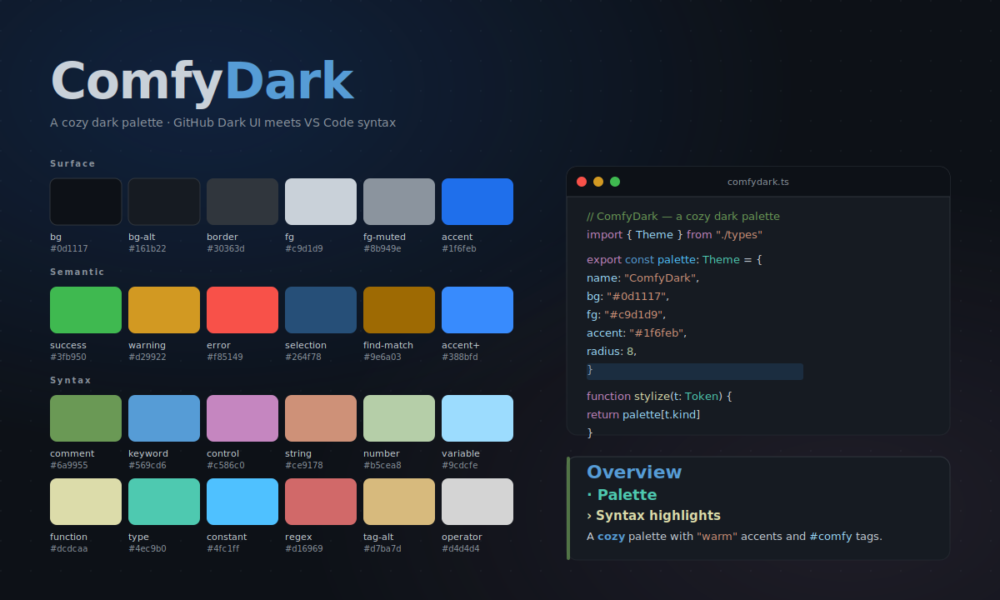

# ComfyDark

A unified dark color scheme using the UI colors from [GitHub Dark Default](https://marketplace.visualstudio.com/items?itemName=GitHub.github-vscode-theme) combined with the default VS Code syntax highlighting palette, ported to multiple editors.



## Apps

Each app has its own folder at the repo root: [`vscode/`](vscode/), [`zed/`](zed/), [`rider/`](rider/), [`obsidian/`](obsidian/), [`opencode/`](opencode/).

## Install

### VS Code

Install from the [Marketplace](https://marketplace.visualstudio.com/items?itemName=JensBech-Srensen.comfydark), then open the Command Palette → *Preferences: Color Theme* → **ComfyDark**.

To build from source:

```sh
cd vscode
just package      # produces comfydark-<version>.vsix
code --install-extension comfydark-*.vsix
```

### Zed

```sh
mkdir -p ~/.config/zed/themes
cp zed/comfydark.json ~/.config/zed/themes/
```

Open the Command Palette (`cmd-shift-p`) → *theme selector: toggle* → **ComfyDark**.

### Obsidian

Copy the folder into your vault's themes directory, where `<vault>` is the root of your Obsidian vault:

```sh
mkdir -p "<vault>/.obsidian/themes/ComfyDark"
cp obsidian/manifest.json obsidian/theme.css "<vault>/.obsidian/themes/ComfyDark/"
```

Reload the vault (`cmd-r`), then **Settings → Appearance → Themes → ComfyDark**. Make sure *Base color scheme* is set to *Dark*.

### opencode

```sh
mkdir -p ~/.config/opencode/themes
cp opencode/comfydark.json ~/.config/opencode/themes/
```

Launch opencode and run `/theme` to pick it, or set it permanently in `~/.config/opencode/tui.json`:

```json
{
  "$schema": "https://opencode.ai/tui.json",
  "theme": "comfydark"
}
```

### Rider (JetBrains)

`rider/rider.json` is a JetBrains Platform UI theme descriptor. JetBrains IDEs don't load these from a config directory — they need to be wrapped in a plugin. Two options:

1. **Run from this repo** (requires the IntelliJ Platform Plugin SDK): open the `rider/` folder in IntelliJ IDEA, add it as a plugin project pointing at `rider.json`, and run the *Run Plugin* configuration — it launches a sandbox IDE with the theme available under **Settings → Appearance & Behavior → Appearance → Theme**.
2. **Import colors only**: copy individual color values from `rider.json` into a custom color scheme via **Settings → Editor → Color Scheme**.
