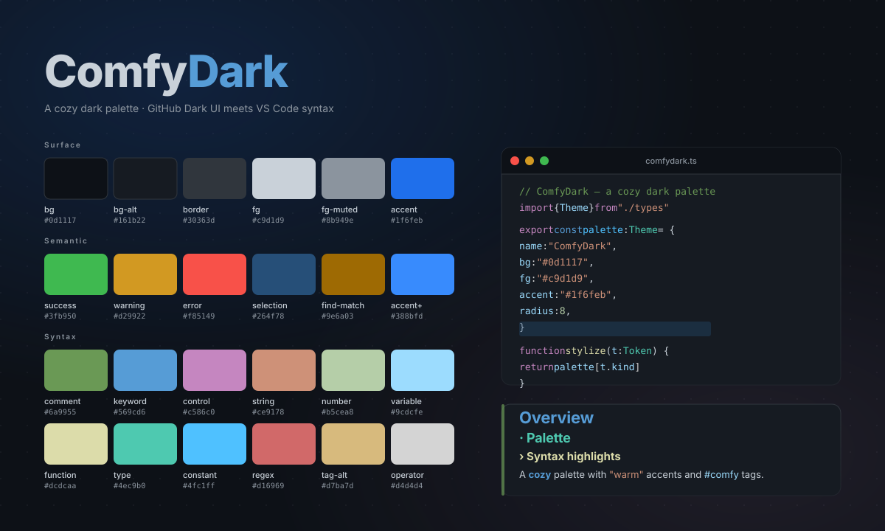

# ComfyDark

A unified dark color scheme using the UI colors from [GitHub Dark Default](https://marketplace.visualstudio.com/items?itemName=GitHub.github-vscode-theme) combined with the default VS Code syntax highlighting palette, ported to multiple editors.



## Apps

Each app has its own folder at the repo root: [`vscode/`](vscode/), [`zed/`](zed/), [`rider/`](rider/), [`obsidian/`](obsidian/), [`opencode/`](opencode/), [`openchamber/`](openchamber/), [`pi/`](pi/), [`t3code/`](t3code/), [`firefox-github/`](firefox-github/), [`firefox-theme/`](firefox-theme/).

## Install

### VS Code

Install from the [Marketplace](https://marketplace.visualstudio.com/items?itemName=JensBech-Srensen.comfydark), then open the Command Palette → *Preferences: Color Theme* → **ComfyDark**.

To build from source:

```sh
cd vscode
just package      # produces comfydark-<version>.vsix
code --install-extension comfydark-*.vsix
```

### Zed

```sh
mkdir -p ~/.config/zed/themes
cp zed/comfydark.json ~/.config/zed/themes/
```

Open the Command Palette (`cmd-shift-p`) → *theme selector: toggle* → **ComfyDark**.

### Obsidian

Copy the folder into your vault's themes directory, where `<vault>` is the root of your Obsidian vault:

```sh
mkdir -p "<vault>/.obsidian/themes/ComfyDark"
cp obsidian/manifest.json obsidian/theme.css "<vault>/.obsidian/themes/ComfyDark/"
```

Reload the vault (`cmd-r`), then **Settings → Appearance → Themes → ComfyDark**. Make sure *Base color scheme* is set to *Dark*.

### opencode

```sh
mkdir -p ~/.config/opencode/themes
cp opencode/comfydark.json ~/.config/opencode/themes/
```

Launch opencode and run `/theme` to pick it, or set it permanently in `~/.config/opencode/tui.json`:

```json
{
  "$schema": "https://opencode.ai/tui.json",
  "theme": "comfydark"
}
```

### OpenChamber

```sh
mkdir -p ~/.config/openchamber/themes
cp openchamber/comfydark.json ~/.config/openchamber/themes/
```

In OpenChamber: **Settings → Theme → Reload themes**, then pick **ComfyDark**. Hot-reload is supported, no restart needed.

### Pi

```sh
mkdir -p ~/.pi/agent/themes
cp pi/comfydark.json ~/.pi/agent/themes/
```

Then either pick **comfydark** in `/settings`, or set it in `~/.pi/agent/settings.json`:

```json
{
  "theme": "comfydark"
}
```

### T3 Code

Open **Settings → Appearance → Theme library** and drag `t3code/comfydark.json` into the import dialog (or use the theme editor, `cmd+alt+shift+t`), then activate **ComfyDark** as the dark half.

T3 Code's theme format only covers UI colors, so syntax highlighting inside code blocks keeps T3 Code's own palette.

### Firefox (GitHub)

A Firefox extension that applies VS Code Dark+ syntax highlighting to code on github.com and gist.github.com.

Load it as a temporary add-on:

1. Open `about:debugging#/runtime/this-firefox` in Firefox.
2. Click **Load Temporary Add-on…**.
3. Select `firefox-github/manifest.json`.

The extension stays active until Firefox is restarted. To install it permanently, package and sign it via [addons.mozilla.org](https://addons.mozilla.org/developers/):

```sh
cd firefox-github
zip -r ../comfydark-firefox-github.zip . -x "README.md"
```

### Firefox (browser theme)

A static theme that applies the ComfyDark palette to the Firefox UI itself — tabs, toolbars, URL bar, menus, sidebar, and the new tab page. See [`firefox-theme/README.md`](firefox-theme/README.md) for the color mapping.

In Firefox Developer Edition, set `xpinstall.signatures.required` to `false` in `about:config`, then install `firefox-theme/comfydark.xpi` via **about:addons → gear icon → Install Add-on From File…**. In other Firefox editions, load `firefox-theme/manifest.json` as a temporary add-on from `about:debugging#/runtime/this-firefox`.

### Rider (JetBrains)

`rider/rider.json` is a JetBrains Platform UI theme descriptor. JetBrains IDEs don't load these from a config directory — they need to be wrapped in a plugin. Two options:

1. **Run from this repo** (requires the IntelliJ Platform Plugin SDK): open the `rider/` folder in IntelliJ IDEA, add it as a plugin project pointing at `rider.json`, and run the *Run Plugin* configuration — it launches a sandbox IDE with the theme available under **Settings → Appearance & Behavior → Appearance → Theme**.
2. **Import colors only**: copy individual color values from `rider.json` into a custom color scheme via **Settings → Editor → Color Scheme**.

## Wallpaper

[`wallpaper/`](wallpaper/) has two 5120×2880 desktop backgrounds built from the palette: ribbons of accent blue flowing across a near-black field (`comfydark-horizon.png` and `comfydark-corner.png` are two phases of the same flow). The currents happen to drift around the top-center, leaving it pure black — so on a notched MacBook the notch and menu bar melt into the bezel without the image looking designed around it. Set one via **System Settings → Wallpaper**.

They're generated by `wallpaper/wallpaper.py` — gradients blended in linear light, then dithered with a touch of grain to avoid banding:

```sh
python3 -m venv .venv && .venv/bin/pip install pillow numpy
.venv/bin/python wallpaper/wallpaper.py
```
